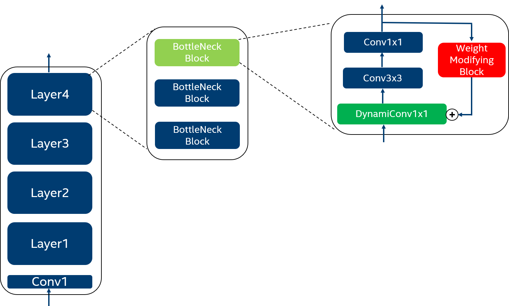

# Adaptive-and-Iteratively-Improving-Recurrent-Lateral-Connections
An official Pytorch implementation of "Adaptive and Iteratively Improving Recurrent Lateral Connections" https://arxiv.org/abs/1910.11105 

  

## Prerequisites
- ubuntu18.04
- python 3.6
- torch==1.2
- torchvision==0.4
- numpy==1.17.4
- cv2
- tensorboard 
  

